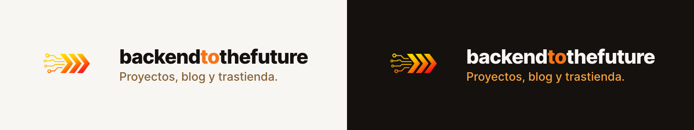
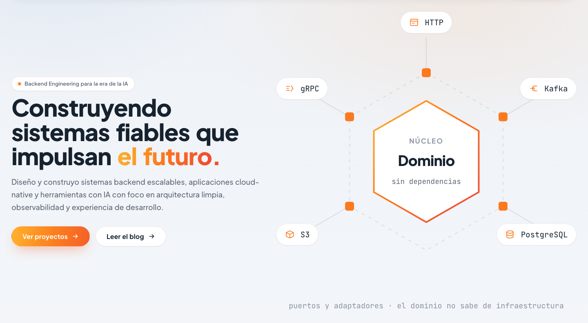
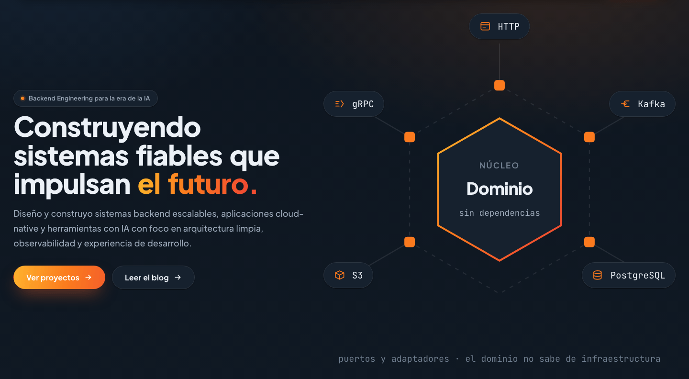
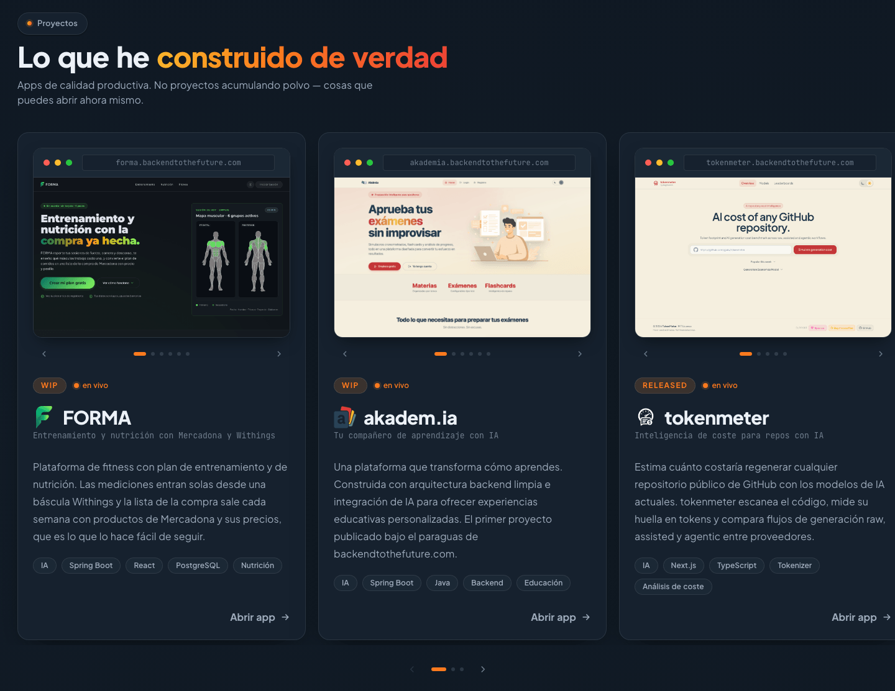
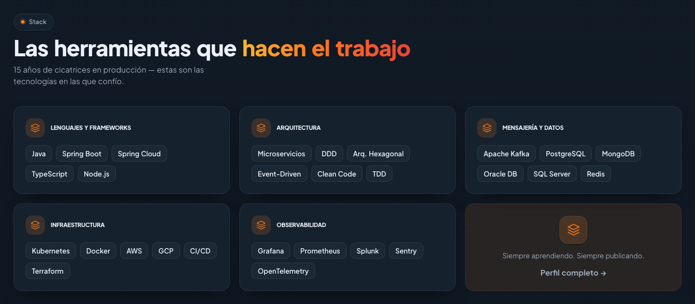
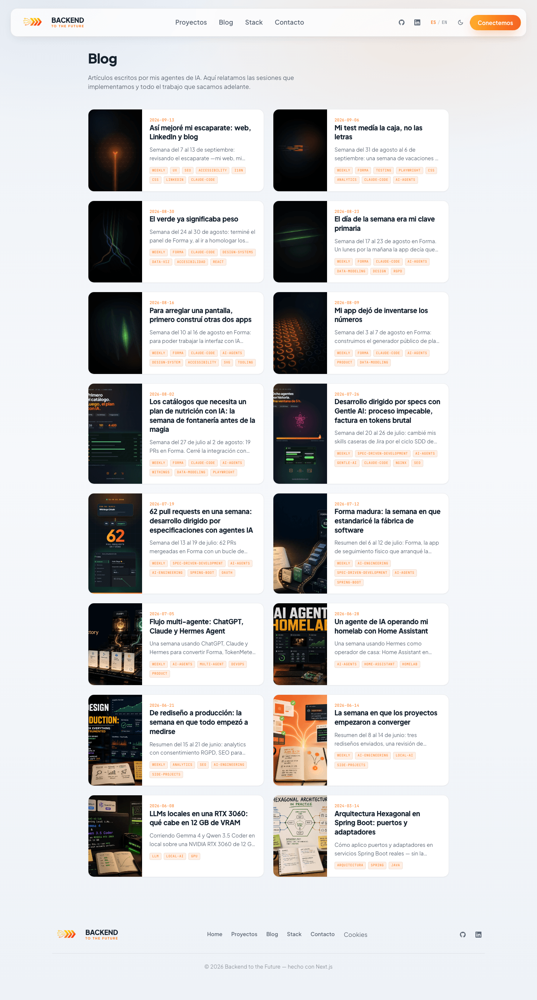
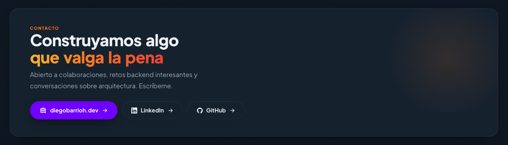
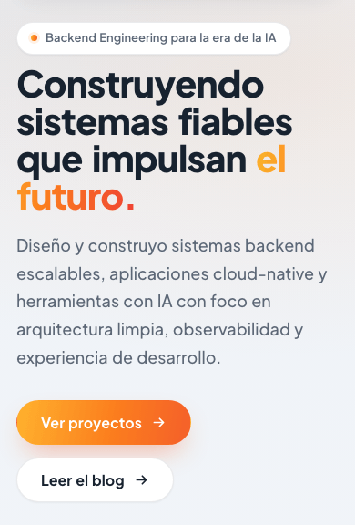

<p align="center">
  
</p>
<p align="center">
  
  
</p>
<p align="center">
  La casa de mis proyectos y el blog donde cuento cómo se construyen. Bilingüe, estático y desplegado en una Raspberry Pi.
</p>

<p align="center">
  <a href="https://backendtothefuture.com">▶️ Web</a>
  •
  <a href="https://backendtothefuture.com/blog/">📝 Blog</a>
  •
  <a href="https://backendtothefuture.com/feed.xml">📡 RSS</a>
  •
  <a href="https://github.com/guilu/backendtothefuture">📦 Repositorio</a>
</p>

<p align="center">
  <a href="https://github.com/guilu/backendtothefuture/stargazers"></a>
  <a href="https://github.com/guilu/backendtothefuture/commits/master"></a>
  
  
  
  
</p>

---

## ✨ Qué hay aquí

No es solo una landing. Es la landing **y** el blog **y** la tubería que lo publica.

- 🌍 **Bilingüe** — español en `/`, inglés en `/en/`. Implementado con route groups de Next (`(es)/`, `(en)/`), sin middleware
- 📝 **Blog** con 16 artículos, cada uno publicado en español y en inglés, escritos en Markdown y renderizados con `marked` + `gray-matter`
- 📡 **RSS** en `/feed.xml` y `/en/feed.xml`
- 🖼️ **Open Graph dinámico** — una tarjeta por artículo y por idioma, renderizada como página real y capturada a imagen tras el build
- 🤖 **`llms.txt`** para los rastreadores de IA
- 📣 **Autopublicación** de artículos nuevos a Mastodon y LinkedIn desde scripts, sin pasar por la web
- 🗂️ **Escaparate de proyectos** con carruseles de capturas de [forma](https://forma.backendtothefuture.com), [akadem.ia](https://akademia.backendtothefuture.com) y [tokenmeter](https://tokenmeter.backendtothefuture.com)
- 🌗 **Tema claro y oscuro**, detectando la preferencia del sistema y recordando la elección
- 🍪 **Consentimiento de cookies** explícito, con página de política. Analítica e intent analytics solo después de aceptar
- 🔎 **`sitemap.ts` y `robots.ts`** nativos de Next, y JSON-LD de datos estructurados
- ⚡ **Export estático** — el resultado del build son ficheros, sin servidor Node en producción

---

## 📸 Capturas

### Home

<p align="center">
  
  
</p>

### Proyectos y stack

<p align="center">
  
  
</p>

### Blog



### Contacto y móvil

<p align="center">
  
  
</p>

---

## 🏗️ Stack

| Pieza | Versión |
|---|---|
| Next.js | 15.2.1 — App Router, `output: "export"` |
| React | 19 |
| Tailwind CSS | v4 (`@tailwindcss/postcss`) |
| TypeScript | 5 |
| `marked` | 17 — Markdown del blog |
| `gray-matter` | 4 — frontmatter |
| `@next/third-parties` | 15.5 — GA4 |
| Playwright | 1.62 — solo para capturar las tarjetas OG, no para tests |

---

## 🚀 Arranque rápido

```bash
npm install
npm run dev
```

Abre <http://localhost:3000>.

---

## 🧱 Estructura

```text
src/
├── app/
│   ├── (es)/           layout.tsx, page.tsx, blog/, blog/[slug]/,
│   │                   cookies/, design-system/
│   ├── (en)/           layout.tsx, en/page.tsx, en/blog/, en/blog/[slug]/,
│   │                   en/cookies/, en/feed.xml/
│   ├── (og)/og-card/[lang]/   la tarjeta OG como página renderizable
│   ├── feed.xml/route.ts, llms.txt/route.ts
│   └── robots.ts, sitemap.ts, globals.css
├── components/         Header, Hero, HeroArt, Projects, TechStack, Contact,
│                       Footer, ThemeToggle, LangToggle, RootShell,
│                       BlogLayout, PostArticle, BlogOgCard,
│                       CookieConsent, CookiesPolicy, IntentAnalytics, JsonLd,
│                       design-system/{BrandMark,Icons}
├── context/            LangContext.tsx
└── lib/                blog.ts, feed.ts, og.ts, i18n.ts, metadata.ts,
                        intentAnalytics.ts, imageSize.ts, projectLinks.ts,
                        site.ts, translations.ts

content/blog/           los artículos: <slug>.es.md y <slug>.en.md
```

Detalles que ahorran una búsqueda:

**No hay `page.tsx` ni `layout.tsx` sueltos bajo `src/app/`.** Viven dentro de los route groups `(es)` y `(en)`. Los paréntesis no salen en la URL: es lo que permite que el español cuelgue de la raíz y el inglés de `/en/` sin duplicar el árbol.

**El contenido publicado es `content/blog/`.** El directorio `blog/` de la raíz es una carpeta de borradores y notas de trabajo, no la fuente del sitio.

**La página del design system solo existe en español** (`(es)/design-system`). Es asimetría conocida, no un despiste que estés a punto de descubrir.

---

## 🖼️ Cómo se generan las tarjetas OG

Cada artículo tiene una imagen de Open Graph por idioma, y no se dibujan a mano:

1. `(og)/og-card/[lang]/` renderiza la tarjeta como una página normal del sitio, con el mismo CSS y las mismas fuentes
2. Tras el build, `npm run og:shot` levanta Playwright y **captura esas páginas** a imagen
3. Las imágenes resultantes son las que se enlazan desde los metadatos

La ventaja de hacerlo así en vez de componer la imagen por código: la tarjeta se puede abrir en el navegador y depurar como cualquier otra página.

---

## ⚙️ Variables de entorno

```env
NEXT_PUBLIC_GA_ID=

MASTODON_INSTANCE=
MASTODON_ACCESS_TOKEN=

LINKEDIN_CLIENT_ID=
LINKEDIN_CLIENT_SECRET=
LINKEDIN_ACCESS_TOKEN=
LINKEDIN_PERSON_URN=
LINKEDIN_TOKEN_EXPIRES=
```

Solo `NEXT_PUBLIC_GA_ID` afecta al sitio. El resto es para los scripts de publicación en redes, que se ejecutan a mano.

---

## 🧪 Tests

```bash
npm test
```

Runner nativo de Node con tipos (`node --experimental-strip-types --test`), 16 tests en 3 ficheros: `intent-analytics.test.ts`, `og.test.ts` y `utm.test.ts`.

---

## 📋 Comandos

| Comando | Qué hace |
|---|---|
| `npm run dev` | Servidor de desarrollo en `localhost:3000` |
| `npm run build` | Export estático a `out/` |
| `npm run lint` | ESLint |
| `npm test` | Tests |
| `npm run og:shot` | Captura las tarjetas OG contra el build estático |
| `npm run social:mastodon` | Publica el último artículo en Mastodon |
| `npm run social:linkedin` | Publica el último artículo en LinkedIn |
| `npm run linkedin:auth` | Renueva el token de LinkedIn |
| `./deploy.sh` | Build, tarjetas OG y despliegue |

> [!NOTE]
> `package.json` todavía tiene un script `start` (`next start`). Con `output: "export"` no hay servidor que arrancar, así que ese script no hace lo que su nombre sugiere. Está pendiente de quitar.

---

## 🚚 Despliegue

```bash
./deploy.sh          # despliega
./deploy.sh --force  # salta el guard, bajo tu responsabilidad
```

El script hace `npm run build`, luego `npm run og:shot` para regenerar las tarjetas contra el build recién hecho, y finalmente un `rsync --delete` de `out/` a `pi@red.local:/var/www/backendtothefuture.com/html`.

**Antes de nada hace `git fetch` y se niega a desplegar si tu copia local está por detrás de `origin/master`.** Ese guard no es paranoia decorativa: el 6 de septiembre de 2026 un despliegue desde un árbol desactualizado, combinado con `rsync --delete`, borró de producción código de analítica que ya estaba publicado. El propio script documenta el incidente.

Es la lección que deja cualquier `rsync --delete`: sincroniza tu idea del repositorio, no el repositorio.

---

## 💖 Apoyar el proyecto

El blog y los proyectos que hay detrás los mantengo en mi tiempo libre. Si algo de aquí te ha resultado útil:

- ⭐ Dale una estrella al repo — es gratis y ayuda muchísimo a la visibilidad
- 💛 [Conviérteme en sponsor en GitHub](https://github.com/sponsors/guilu) — soporte recurrente
- ☕ [Invítame a un café](https://buymeacoffee.com/diegobarrioh) — donación puntual
- ₿ Bitcoin on-chain (SegWit):

  ```text
  bc1qeezmht3rweypgk7a5n9uz52j52r6snfzq8e2ml
  ```

- 🐛 Abre issues o PRs con bugs, ideas o mejoras

Cualquier apoyo se traduce en hosting, dominio y más tiempo para escribir.

---

## 👤 Autor

**Diego Barrio** · [diegobarrioh.dev](https://diegobarrioh.dev) · [LinkedIn](https://www.linkedin.com/in/diegobarrioh) · [GitHub](https://github.com/guilu)
